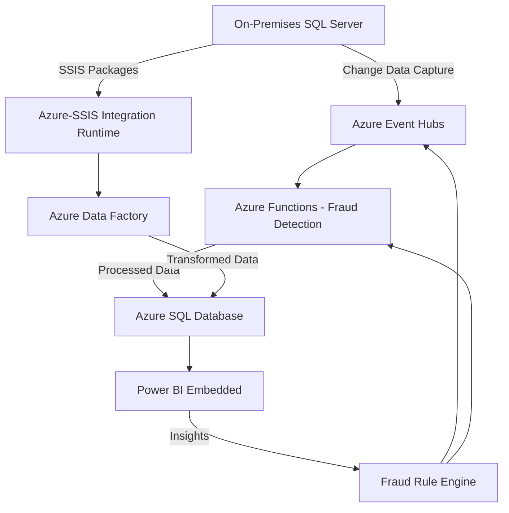

# Enterprise-Grade ETL Pipeline for Financial Analytics with Real-Time Fraud Detection

**Technical Implementation Guide**  
*Leveraging Microsoft Azure Cloud Services, .NET Microservices, and Data Governance Practices*

---

## 1. Executive Summary
In the fast-paced financial industry, real-time transaction processing and fraud detection are critical for maintaining operational resilience and ensuring regulatory compliance. This guide details the design and deployment of an enterprise-grade ETL (Extract, Transform, Load) pipeline using Microsoft Azure Cloud Services. Built on Azure’s scalable infrastructure and aligned with AZ-900 foundational concepts, this solution combines real-time streaming, batch processing, and advanced analytics to provide actionable insights.

Key objectives include:  
- **Scalability**: Handle high-velocity data with Azure’s elastic cloud services.  
- **Security**: Protect sensitive financial data using Azure’s robust security features.  
- **Compliance**: Adhere to regulations like GDPR with Azure’s compliance tools.  
- **Cost Optimization**: Utilize Azure’s pricing models for efficient resource use.  

This document offers a structured roadmap, covering architecture, implementation phases, governance, and a 6-week Minimum Viable Product (MVP) plan.

---

## 2. Table of Contents
1. [Executive Summary](#1-executive-summary)  
2. [Table of Contents](#2-table-of-contents)  
3. [Azure Cloud Benefits](#3-azure-cloud-benefits)  
4. [Technology Stack Overview](#4-technology-stack-overview)  
5. [Solution Architecture](#5-solution-architecture)  
6. [Implementation Phases](#6-implementation-phases)  
   - [Phase 1: Bronze Layer - Data Ingestion](#61-phase-1-bronze-layer---data-ingestion)  
   - [Phase 2: Silver Layer - Data Transformation](#62-phase-2-silver-layer---data-transformation)  
   - [Phase 3: Gold Layer - Data Analytics](#63-phase-3-gold-layer---data-analytics)  
7. [Security, Privacy, and Compliance](#7-security-privacy-and-compliance)  
8. [Cost Management and Pricing](#8-cost-management-and-pricing)  
9. [Operational Monitoring](#9-operational-monitoring)  
10. [MVP Development Plan](#10-mvp-development-plan)  
11. [Conclusion](#11-conclusion)  
12. [References](#12-references)  

---

## 3. Azure Cloud Benefits
Microsoft Azure provides a robust platform for this solution, offering:  
- **Cloud Concepts**: Flexible IaaS, PaaS, and SaaS options for scalability.  
- **Core Services**: Compute (Azure Functions), storage (Azure SQL Database), and data integration (Azure Data Factory).  
- **Security and Compliance**: Encryption, identity management, and global compliance standards.  
- **Pricing Models**: Pay-as-you-go and reserved instances for cost efficiency.  

These features ensure high availability, resilience, and scalability for financial workloads.

---

## 4. Technology Stack Overview
The solution integrates on-premises and Azure services:

| **Component**                 | **Azure Service Category** | **Purpose**                                      |
|-------------------------------|----------------------------|--------------------------------------------------|
| On-Premises SQL Server        | N/A (On-Premises)          | Source of transactional data                     |
| Azure Event Hubs              | Analytics                  | Real-time event ingestion and streaming          |
| Azure-SSIS Integration Runtime| Data Integration           | Managed execution of SSIS packages               |
| Azure Functions (.NET)        | Compute                    | Serverless fraud detection processing            |
| Azure Data Factory            | Data Integration           | Orchestration of ETL workflows                   |
| Azure SQL Database            | Databases                  | Managed storage for transformed data             |
| Power BI Embedded             | Analytics                  | Embedded interactive reporting                    |
| Azure Purview                 | Governance                 | Data lineage and compliance management           |
| Azure RBAC                    | Security                   | Role-based access control                        |
| Azure Monitor                 | Management and Monitoring  | Performance and health monitoring                |

---

## 5. Solution Architecture

### 5.1 Data Flow Diagram

### 5.2 Core Components
- **Azure Event Hubs**: Ingests millions of events per second for real-time streaming.  
- **Azure Functions**: Serverless compute for event-driven fraud detection.  
- **Azure Data Factory**: Manages ETL workflows.  
- **Azure SQL Database**: Stores transformed data with high availability.

---

## 6. Implementation Phases

### 6.1 Phase 1: Bronze Layer - Data Ingestion
**Objective**: Ingest raw data into Azure.  
**Key Services**: Azure Event Hubs, Azure-SSIS Integration Runtime  
**Steps**:  
1. Set up Change Data Capture (CDC) on SQL Server for transaction streaming.  
2. Deploy Azure Event Hubs with 16 partitions for scalability.  
3. Use Azure-SSIS Integration Runtime to migrate legacy SSIS packages for batch processing.

### 6.2 Phase 2: Silver Layer - Data Transformation
**Objective**: Validate and enrich data.  
**Key Services**: Azure Data Factory, Azure Functions  
**Steps**:  
1. Build Azure Data Factory pipelines for data cleansing and validation.  
2. Apply real-time fraud detection rules with Azure Functions (e.g., risk scoring).  
3. Store results in Azure SQL Database.

### 6.3 Phase 3: Gold Layer - Data Analytics
**Objective**: Deliver aggregated insights.  
**Key Services**: Azure SQL Database, Power BI Embedded  
**Steps**:  
1. Create a dimensional model with fact and dimension tables.  
2. Load aggregated data via Azure Data Factory.  
3. Embed Power BI reports for real-time analytics.

---

## 7. Security, Privacy, and Compliance
- **Encryption**: Transparent Data Encryption (TDE) secures data at rest in Azure SQL Database.  
- **Identity Management**: Azure RBAC restricts access to authorized users.  
- **Compliance**: Azure Purview ensures data lineage for GDPR and financial regulations.  
- **Monitoring**: Azure Monitor logs operations for audits.

---

## 8. Cost Management and Pricing
- **Pay-as-You-Go**: Scales costs with usage for Azure Functions and Event Hubs.  
- **Reserved Instances**: Reduces costs for Azure SQL Database.  
- **Cost Management Tools**: Azure Cost Management optimizes spending.  
- **Optimization**: Serverless services and query tuning lower resource use.

---

## 9. Operational Monitoring
Using Azure Monitor:  
- **Metrics**: Monitor CPU, memory, and latency.  
- **Alerts**: Set thresholds for proactive responses.  
- **Diagnostics**: Application Insights debugs Azure Functions.

---

## 10. MVP Development Plan
### 10.1 Scope
Deliver core ETL and fraud detection in 6 weeks (30 days).

### 10.2 Task Breakdown
| **Task**                       | **Duration (Days)** | **Azure Service**         |
|--------------------------------|---------------------|---------------------------|
| Set Up Azure Environment       | 2                   | Resource Groups, Azure AD |
| Configure Data Ingestion       | 5                   | Event Hubs, SSIS IR       |
| Develop Fraud Detection Logic  | 5                   | Azure Functions           |
| Build ETL Pipelines            | 5                   | Azure Data Factory        |
| Deploy Database Schema         | 3                   | Azure SQL Database        |
| Integrate Power BI Reporting   | 5                   | Power BI Embedded         |
| Implement Security and Monitoring | 5                | RBAC, Azure Monitor       |

**Total**: 30 days

---

## 11. Conclusion
This guide outlines a scalable, secure, and cost-effective ETL pipeline for financial analytics and fraud detection, leveraging Azure’s cloud capabilities. It aligns with AZ-900 concepts, making it ideal for enterprise deployment.

---

## 12. References
- [Microsoft Azure Documentation](https://learn.microsoft.com/en-us/azure/)  
- [AZ-900 Exam Overview](https://learn.microsoft.com/en-us/certifications/exams/az-900)  
- [Azure Event Hubs](https://learn.microsoft.com/en-us/azure/event-hubs/)  
- [Azure Data Factory](https://learn.microsoft.com/en-us/azure/data-factory/)  
- [Azure Compliance Offerings](https://learn.microsoft.com/en-us/azure/compliance/)
