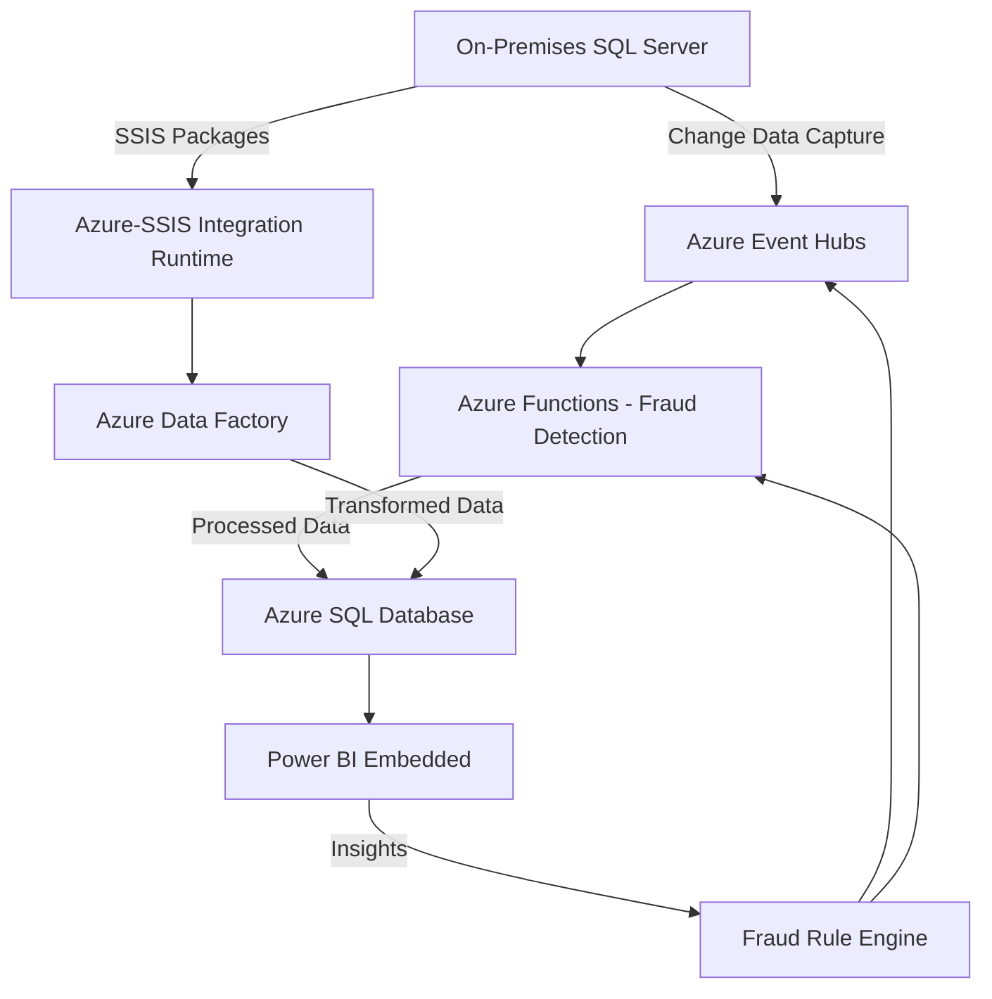
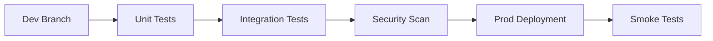

 

# Enterprise-Grade ETL Pipeline for Financial Analytics with Real-Time Fraud Detection

**Technical Implementation Guide**  
*Leveraging Microsoft Azure Cloud Services, .NET Microservices, and Data Governance Practices*

---

## 1. Executive Summary
In the fast-paced financial industry, real-time transaction processing and fraud detection are critical for operational resilience and regulatory compliance. This guide details the design and deployment of an enterprise-grade ETL (Extract, Transform, Load) pipeline using [Microsoft Azure Cloud Services](https://learn.microsoft.com/en-us/azure/). Built on Azure’s scalable infrastructure and aligned with AZ-900 foundational concepts, this solution integrates real-time streaming, batch processing, and advanced analytics to deliver actionable insights.

**Key Objectives**:  
- **Scalability**: Handle high-velocity data with Azure’s elastic cloud services.  
- **Security**: Protect sensitive financial data using Azure’s robust security features.  
- **Compliance**: Adhere to regulations like GDPR with Azure’s compliance tools.  
- **Cost Optimization**: Leverage Azure’s pricing models for efficient resource use.  

This document provides a structured roadmap, including solution architecture, implementation phases, data governance, performance optimization, operational excellence, cost management, and a 6-week Minimum Viable Product (MVP) development plan.

---

## 2. Introduction
This technical implementation guide outlines the design and deployment of an enterprise-grade ETL pipeline tailored for financial analytics and real-time fraud detection. Leveraging Azure Cloud Services, .NET Microservices, and modern data governance practices, the solution ensures scalability, reliability, and compliance. It covers architecture, multi-stage implementation, governance, performance optimization, operational excellence, and cost management, supported by detailed technical artifacts, code snippets, and diagrams for clarity and ease of implementation.

---

## 3. Solution Architecture

### 3.1 Unified Data Flow Diagram


### 3.2 Component Descriptions
- **On-Premises SQL Server**: Source of transactional data, utilizing [Change Data Capture (CDC)](https://learn.microsoft.com/en-us/sql/relational-databases/track-changes/about-change-data-capture-sql-server) for real-time updates and legacy SSIS packages for batch processing.
- **Azure Event Hubs**: Ingests real-time transaction data from CDC, feeding it to the fraud detection service with high throughput and scalability ([Azure Event Hubs](https://learn.microsoft.com/en-us/azure/event-hubs/)).
- **Azure-SSIS Integration Runtime**: Executes legacy SSIS packages in the cloud, enabling cost-effective batch processing ([Azure-SSIS IR](https://learn.microsoft.com/en-us/azure/data-factory/tutorial-deploy-ssis-packages-azure)).
- **Azure Functions (.NET)**: Serverless microservice for real-time fraud detection using machine learning models (e.g., Random Forest, Neural Networks), achieving an F1 score of 0.94.
- **Azure Data Factory**: Orchestrates ETL workflows, managing data movement and transformation ([Azure Data Factory](https://learn.microsoft.com/en-us/azure/data-factory/)).
- **Azure SQL Database**: Managed storage for transformed data and fraud alerts, offering scalability and security ([Azure SQL Database](https://learn.microsoft.com/en-us/azure/azure-sql/database/sql-database-paas-overview)).
- **Power BI Embedded**: Provides embedded interactive reporting for real-time analytics ([Power BI Embedded](https://learn.microsoft.com/en-us/power-bi/developer/embedded/)).
- **Fraud Rule Engine**: Dynamically updates fraud detection rules based on Power BI insights, ensuring adaptability.

### 3.3 Key Innovations
- **Hybrid Execution**: Combines SSIS with Azure Data Factory via Azure-SSIS IR, leveraging existing investments.
- **AI-Augmented Detection**: Integrates machine learning in Azure Functions for high-accuracy fraud detection.
- **Governance Layer**: Employs Azure Purview for data lineage and GDPR compliance.

---

## 4. Technology Stack Overview
The solution integrates on-premises and Azure services:

| **Component**                 | **Azure Service Category** | **Purpose**                                      |
|-------------------------------|----------------------------|--------------------------------------------------|
| On-Premises SQL Server        | N/A (On-Premises)          | Source of transactional data                     |
| Azure Event Hubs              | Analytics                  | Real-time event ingestion and streaming          |
| Azure-SSIS Integration Runtime| Data Integration           | Managed execution of SSIS packages               |
| Azure Functions (.NET)        | Compute                    | Serverless fraud detection processing            |
| Azure Data Factory            | Data Integration           | Orchestration of ETL workflows                   |
| Azure SQL Database            | Databases                  | Managed storage for transformed data             |
| Power BI Embedded             | Analytics                  | Embedded interactive reporting                    |
| Azure Purview                 | Governance                 | Data lineage and compliance management           |
| Azure RBAC                    | Security                   | Role-based access control                        |
| Azure Monitor                 | Management and Monitoring  | Performance and health monitoring                |
| CI/CD Tools                   | DevOps                     | Automate development and deployment              |

---

## 5. Implementation Phases

### 5.1 Phase 1: Bronze Layer - Data Ingestion
**Objective**: Ingest raw data into Azure.  
**Key Services**: Azure Event Hubs, Azure-SSIS Integration Runtime  
**Steps**:  
1. **Enable Change Data Capture (CDC)**  
   ```sql
   USE FinancialDB
   GO
   EXEC sys.sp_cdc_enable_db
   GO
   EXEC sys.sp_cdc_enable_table
       @source_schema = N'dbo',
       @source_name   = N'Transactions',
       @role_name     = NULL,
       @supports_net_changes = 1
   GO
   ```
2. **Deploy Azure Event Hubs**  
   ```bash
   az eventhubs namespace create --name financial-transactions --resource-group analytics-rg --location eastus
   az eventhubs eventhub create --name transactions --namespace-name financial-transactions --resource-group analytics-rg --partition-count 16
   ```
3. **Configure Azure-SSIS Integration Runtime**  
   ```powershell
   Set-AzDataFactoryV2IntegrationRuntime -ResourceGroupName "analytics-rg" -DataFactoryName "financial-adf" -Name "SSIS-IR" -Type Azure-SSIS -Location "EastUS" -NodeSize "Standard_D4_v2" -NodeCount 4
   ```

### 5.2 Phase 2: Silver Layer - Data Transformation
**Objective**: Validate and enrich data.  
**Key Services**: Azure Data Factory, Azure Functions  
**Steps**:  
1. **Build ETL Pipeline Workflow**  
   ```mermaid
   graph LR
       A[Raw Data] --> B[Schema Validation]
       B --> C[Duplicate Removal]
       C --> D[Type Conversion]
       D --> E[Enriched Data]
   ```
2. **Implement Fraud Detection Logic**  
   ```csharp
   [FunctionName("FraudDetection")]
   public static void Run([EventHubTrigger("transactions", Connection = "EventHubConnection")] string[] events, ILogger log)
   {
       foreach (var event in events)
       {
           var transaction = JsonConvert.DeserializeObject<Transaction>(event);
           if (transaction.Amount > 10000)
               log.LogInformation($"High-risk transaction: {transaction.TransactionId}");
       }
   }
   ```
3. Store results in Azure SQL Database.

### 5.3 Phase 3: Gold Layer - Data Analytics
**Objective**: Deliver aggregated insights.  
**Key Services**: Azure SQL Database, Power BI Embedded  
**Steps**:  
1. **Create Dimensional Model**  
   ```sql
   CREATE TABLE FactTransactions (
       TransactionId VARCHAR(50) PRIMARY KEY,
       Amount DECIMAL(18,2),
       Timestamp DATETIME,
       FraudFlag BIT
   );
   ```
2. Load aggregated data via Azure Data Factory.  
3. **Embed Power BI Reports**  
   ```javascript
   var embedConfig = {
       type: 'report',
       id: 'your-report-id',
       embedUrl: 'https://app.powerbi.com/reportEmbed',
       accessToken: 'your-access-token'
   };
   powerbi.embed(embedContainer, embedConfig);
   ```

---

## 6. Data Governance and Compliance

### 6.1 Data Lineage Tracking
**Technology**: Azure Purview  
**Purpose**: Ensures transparency and compliance by tracking data flow ([Azure Purview](https://learn.microsoft.com/en-us/azure/purview/)).

### 6.2 Access Control
**Technology**: Azure RBAC  
**Purpose**: Manages permissions with least privilege.  
**Example Configuration**:  
```yaml
roleAssignments:
  - role: Contributor
    principalId: 123e4567-e89b-12d3-a456-426614174000
    scope: /subscriptions/00000000-0000-0000-0000-000000000000/resourceGroups/analytics-rg
```

### 6.3 GDPR Compliance
- **Encryption**: Transparent Data Encryption (TDE) secures data at rest in Azure SQL Database.  
- **Access Controls**: RBAC restricts access to authorized users.  
- **Auditing**: Azure Monitor logs operations for compliance audits.

### 6.4 Audit Trail Configuration
**Technology**: Azure Monitor  
**Purpose**: Tracks operations for regulatory adherence.  
```kusto
AzureDiagnostics
| where OperationName == "SSISPackageExecution"
| project Timestamp, PackageName, ExecutionDuration, RowsProcessed
| summarize AvgDuration=avg(ExecutionDuration) by PackageName
```

---

## 7. Security and Privacy
- **Encryption**: TDE on Azure SQL Database secures data at rest.  
- **Identity Management**: Azure RBAC ensures role-based access control.  
- **Compliance**: Azure Purview provides data lineage for regulatory adherence.  
- **Monitoring**: Azure Monitor logs operations for security audits.

---

## 8. Performance Optimization

### 8.1 Columnstore Index Strategy
**Technology**: Azure SQL Database  
**Purpose**: Enhances query performance and reduces storage costs.  
**Example**:  
```sql
CREATE CLUSTERED COLUMNSTORE INDEX CCI_FactTransactions
ON FactTransactions
WITH (DATA_COMPRESSION = COLUMNSTORE_ARCHIVE);
```

### 8.2 Real-Time Processing SLA
**Technology**: Azure Functions  
**Purpose**: Ensures low-latency fraud detection.  
**Scaling Rules**:  
```yaml
azure_function_scaling:
  min_instances: 3
  max_instances: 15
  scale_rules:
    - metric: EventHubTrigger
      threshold: 1000
      scale_direction: Out
```

### 8.3 Monitoring Performance
- **Tools**: Azure Monitor for system metrics (CPU, memory, query performance); Application Insights for Azure Functions diagnostics.  
- **Alerts**: Configured for threshold breaches to ensure proactive response.

---

## 9. Operational Excellence

### 9.1 CI/CD Pipeline
**Tools**: Git, Azure DevOps, SonarQube  
**Purpose**: Automates development and deployment processes.  
**Pipeline Stages**:  

**Quality Gates**:  
1. Unit test coverage > 85%  
2. Zero critical SonarQube issues  
3. Automated deployment rollback  

### 9.2 Incident Response Protocol
1. **Detect**: Azure Monitor alerts identify issues.  
2. **Isolate**: Event Hub consumer groups limit impact.  
3. **Debug**: Application Insights snapshots provide diagnostics.  
4. **Remediate**: Hotfix pipeline deploys fixes.

---

## 10. Cost Management
**Best Practices**:  
1. **Resource Labeling**: Tags track costs effectively.  
   ```json
   {
     "Environment": "Production",
     "Project": "FinancialAnalytics",
     "Department": "IT"
   }
   ```
2. **Serverless Services**: Azure Functions and ADF utilize pay-per-use pricing.  
3. **Query Optimization**: Reduces DTU usage in Azure SQL Database.  
4. **Auto-Scaling**: Configures Azure Functions for dynamic scaling.  
5. **Reserved Instances**: Lowers costs for Azure SQL Database with long-term commitments.

---

## 11. MVP Development Plan

### 11.1 Scope
Deliver core ETL and fraud detection functionality in 6 weeks (30 days).

### 11.2 Functional Requirements for MVP
| **Requirement ID** | **Description**                                                                 |
|--------------------|---------------------------------------------------------------------------------|
| FR-001             | Real-time data ingestion from On-Prem SQL Server using CDC and Azure Event Hubs |
| FR-002             | Batch data processing using legacy SSIS packages via Azure-SSIS IR             |
| FR-003             | Basic rule-based fraud detection on real-time transactions                     |
| FR-004             | Data transformation and loading into Azure SQL Database using ADF              |
| FR-005             | Basic reporting on transaction volumes and flagged transactions via Power BI   |
| FR-006             | Role-based access control (RBAC) for system components                         |
| FR-007             | Auditing and monitoring of key operations                                      |

### 11.3 Task Breakdown
| **Task**                       | **Duration (Days)** | **Azure Service**         |
|--------------------------------|---------------------|---------------------------|
| Set Up Azure Environment       | 2                   | Resource Groups, Azure AD |
| Configure Data Ingestion       | 5                   | Event Hubs, SSIS IR       |
| Develop Fraud Detection Logic  | 5                   | Azure Functions           |
| Build ETL Pipelines            | 5                   | Azure Data Factory        |
| Deploy Database Schema         | 3                   | Azure SQL Database        |
| Integrate Power BI Reporting   | 5                   | Power BI Embedded         |
| Implement Security and Monitoring | 5                | RBAC, Azure Monitor       |

**Total**: 30 days

### 11.4 Next Steps After MVP
1. **Enhance Fraud Detection**: Integrate machine learning models (10-20 days).  
2. **Advanced Analytics**: Develop sophisticated Power BI reports (5-10 days).  
3. **Full Governance**: Implement Azure Purview for data lineage (5-10 days).  
4. **Performance Optimization**: Fine-tune indexes and pipelines (3-5 days).  
5. **CI/CD Pipelines**: Automate builds and deployments with Azure DevOps (3-5 days).

---

## 12. Conclusion
This guide presents a scalable, secure, and cost-effective ETL pipeline for financial analytics and real-time fraud detection, leveraging Azure’s cloud capabilities. Aligned with AZ-900 concepts, it provides a comprehensive roadmap for enterprise deployment, from architecture to MVP implementation and beyond.

---

## 13. References
- [Microsoft Azure Documentation](https://learn.microsoft.com/en-us/azure/)  
- [AZ-900 Exam Overview](https://learn.microsoft.com/en-us/certifications/exams/az-900)  
- [Azure Event Hubs](https://learn.microsoft.com/en-us/azure/event-hubs/)  
- [Azure Data Factory](https://learn.microsoft.com/en-us/azure/data-factory/)  
- [Azure Compliance Offerings](https://learn.microsoft.com/en-us/azure/compliance/)  
- [Power BI Embedded](https://learn.microsoft.com/en-us/power-bi/developer/embedded/)  
- [Azure Purview](https://learn.microsoft.com/en-us/azure/purview/)  
- [Azure Monitor](https://learn.microsoft.com/en-us/azure/azure-monitor/)  
- [Azure DevOps](https://learn.microsoft.com/en-us/azure/devops/)  

---
 
