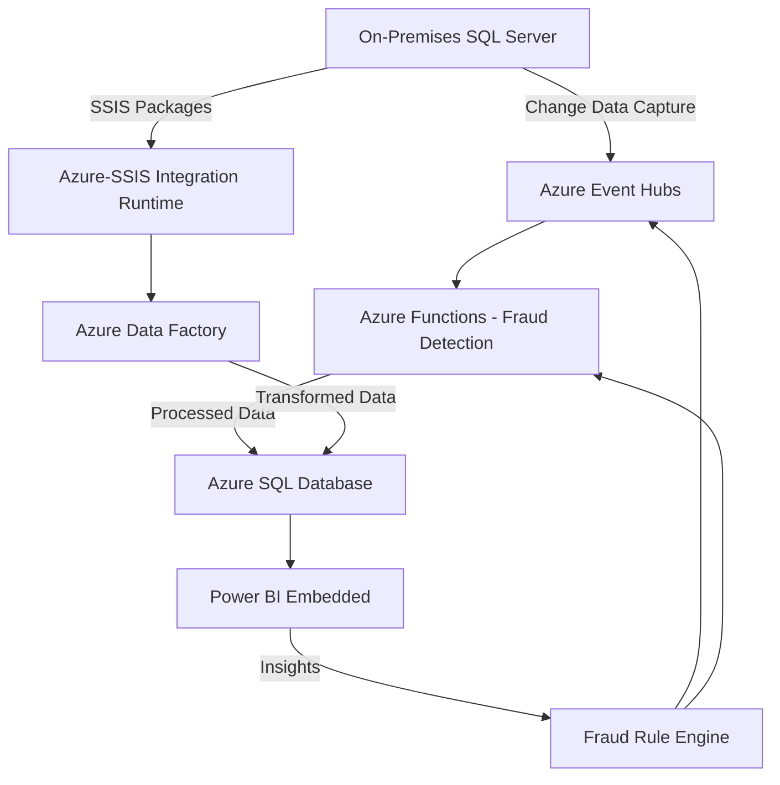

# Enterprise-Grade ETL Pipeline for Financial Analytics with Real-Time Fraud Detection

**Technical Implementation Guide**  
*Leveraging Microsoft Azure Cloud Services, .NET Microservices, and Data Governance Practices*

---

## 1. Executive Summary
In the dynamic financial sector, real-time transaction processing and fraud detection are paramount for operational resilience and regulatory adherence. This technical implementation guide outlines the design and deployment of an enterprise-grade ETL (Extract, Transform, Load) pipeline utilizing [Microsoft Azure Cloud Services](https://learn.microsoft.com/en-us/azure/). Built on Azure’s scalable infrastructure and aligned with AZ-900 foundational concepts, this solution integrates real-time streaming, batch processing, and advanced analytics to deliver actionable insights.

Key objectives include:
- **Scalability**: Processing high-velocity data using Azure’s elastic cloud services.
- **Security**: Safeguarding sensitive financial data with Azure’s robust security features.
- **Compliance**: Meeting regulatory standards like GDPR through Azure’s compliance offerings.
- **Cost Optimization**: Leveraging Azure’s pricing models for efficient resource utilization.

This document provides a structured roadmap, including architecture, implementation phases, governance, and a 6-week Minimum Viable Product (MVP) plan, with references to AZ-900 exam domains for alignment with Azure fundamentals.

---

## 2. Table of Contents
1. [Executive Summary](#1-executive-summary)
2. [Table of Contents](#2-table-of-contents)
3. [Azure Cloud Benefits](#3-azure-cloud-benefits)
4. [Technology Stack Overview](#4-technology-stack-overview)
5. [Solution Architecture](#5-solution-architecture)
6. [Implementation Phases](#6-implementation-phases)
   - [Phase 1: Bronze Layer - Data Ingestion](#61-phase-1-bronze-layer---data-ingestion)
   - [Phase 2: Silver Layer - Data Transformation](#62-phase-2-silver-layer---data-transformation)
   - [Phase 3: Gold Layer - Data Analytics](#63-phase-3-gold-layer---data-analytics)
7. [Security, Privacy, and Compliance](#7-security-privacy-and-compliance)
8. [Cost Management and Pricing](#8-cost-management-and-pricing)
9. [Operational Monitoring](#9-operational-monitoring)
10. [MVP Development Plan](#10-mvp-development-plan)
11. [Conclusion](#11-conclusion)
12. [References](#12-references)

---

## 3. Azure Cloud Benefits
Microsoft Azure, a leader in public cloud platforms, provides a comprehensive suite of services aligned with AZ-900 domains:
- **Cloud Concepts**: Offers Infrastructure as a Service (IaaS), Platform as a Service (PaaS), and Software as a Service (SaaS) for flexibility and scalability.
- **Core Azure Services**: Includes compute (Azure Functions), storage (Azure SQL Database), and data integration (Azure Data lingerFactory).
- **Security and Compliance**: Features encryption, identity management, and compliance with global standards.
- **Pricing Models**: Provides pay-as-you-go and reserved instances for cost efficiency.

This pipeline leverages these benefits to ensure high availability, resilience, and economic scalability for financial workloads.

---

## 4. Technology Stack Overview
The solution integrates on-premises and Azure services, mapped to AZ-900 core services:

| **Component**                 | **Azure Service Category** | **Purpose**                                      |
|-------------------------------|----------------------------|--------------------------------------------------|
| On-Premises SQL Server        | N/A (On-Premises)          | Source of transactional data                     |
| Azure Event Hubs              | Analytics                  | Real-time event ingestion and streaming          |
| Azure-SSIS Integration Runtime| Data Integration           | Managed execution of SSIS packages               |
| Azure Functions (.NET)        | Compute                    | Serverless fraud detection processing            |
| Azure Data Factory            | Data Integration           | Orchestration of ETL workflows                   |
| Azure SQL Database            | Databases                  | Managed storage for transformed data             |
| Power BI Embedded             | Analytics                  | Embedded interactive reporting                    |
| Azure Purview                 | Governance                 | Data lineage and compliance management           |
| Azure RBAC                    | Security                   | Role-based access control                        |
| Azure Monitor                 | Management and Monitoring  | Performance and health monitoring                |

---

## 5. Solution Architecture

### 5.1 Data Flow Diagram

### 5.2 Core Components
- **Azure Event Hubs**: A PaaS offering for ingesting millions of events per second, enabling real-time data streaming.
- **Azure Functions**: A serverless compute service for event-driven fraud detection, auto-scaling to demand.
- **Azure Data Factory**: A fully managed data integration service orchestrating ETL processes.
- **Azure SQL Database**: A PaaS relational database with high availability and built-in security.

---

## 6. Implementation Phases

### 6.1 Phase 1: Bronze Layer - Data Ingestion
**Objective**: Ingest raw data from on-premises systems into Azure.  
**Key Services**: Azure Event Hubs, Azure-SSIS Integration Runtime  
**Steps**:  
1. Configure Change Data Capture (CDC) on SQL Server to stream transaction changes.
2. Deploy Azure Event Hubs for real-time ingestion (16 partitions for scalability).
3. Use Azure-SSIS Integration Runtime to lift and shift legacy SSIS packages for batch processing.

### 6.2 Phase 2: Silver Layer - Data Transformation
**Objective**: Validate and enrich ingested data.  
**Key Services**: Azure Data Factory, Azure Functions  
**Steps**:  
1. Implement Azure Data Factory pipelines for schema validation and data cleansing.
2. Use Azure Functions to apply real-time fraud detection rules (e.g., risk scoring).
3. Store transformed data in Azure SQL Database.

### 6.3 Phase 3: Gold Layer - Data Analytics
**Objective**: Aggregate data and deliver insights.  
**Key Services**: Azure SQL Database, Power BI Embedded  
**Steps**:  
1. Design a dimensional model with fact and dimension tables.
2. Load aggregated data using Azure Data Factory.
3. Embed Power BI reports for real-time transaction and fraud analytics.

---

## 7. Security, Privacy, and Compliance
Aligned with AZ-900 security and compliance domains, the pipeline incorporates:
- **Encryption**: Transparent Data Encryption (TDE) on Azure SQL Database secures data at rest.
- **Identity Management**: Azure Role-Based Access Control (RBAC) restricts access to authorized roles.
- **Compliance**: Azure Purview tracks data lineage, supporting GDPR and financial regulations.
- **Monitoring**: Azure Monitor logs operations for auditability.

---

## 8. Cost Management and Pricing
Per AZ-900 pricing and support concepts:
- **Pay-as-You-Go**: Azure Functions and Event Hubs scale costs with usage.
- **Reserved Instances**: Azure SQL Database reserved capacity reduces long-term costs.
- **Cost Management Tools**: Azure Cost Management tracks and optimizes spending.
- **Optimization**: Serverless services and query tuning minimize resource consumption.

---

## 9. Operational Monitoring
Using Azure Monitor (AZ-900 management tools):
- **Metrics**: Track CPU, memory, and latency across services.
- **Alerts**: Configure thresholds for proactive incident response.
- **Diagnostics**: Application Insights provides detailed debugging for Azure Functions.

---

## 10. MVP Development Plan
### 10.1 Scope
Deliver core ETL and fraud detection functionality in 6 weeks (30 days).

### 10.2 Task Breakdown
| **Task**                       | **Duration (Days)** | **Azure Service**         |
|--------------------------------|---------------------|---------------------------|
| Set Up Azure Environment       | 2                   | Resource Groups, Azure AD |
| Configure Data Ingestion       | 5                   | Event Hubs, SSIS IR       |
| Develop Fraud Detection Logic  | 5                   | Azure Functions           |
| Build ETL Pipelines            | 5                   | Azure Data Factory        |
| Deploy Database Schema         | 3                   | Azure SQL Database        |
| Integrate Power BI Reporting   | 5                   | Power BI Embedded         |
| Implement Security and Monitoring | 5                | RBAC, Azure Monitor       |

**Total**: 30 days

---

## 11. Conclusion
This guide presents a professional, AZ-900-aligned implementation of an ETL pipeline for financial analytics and fraud detection. By leveraging Azure’s cloud services, security features, and pricing models, it delivers a scalable, secure, and cost-effective solution tailored to enterprise needs.

---

## 12. References
- [Microsoft Azure Documentation](https://learn.microsoft.com/en-us/azure/)
- [AZ-900 Exam Overview](https://learn.microsoft.com/en-us/certifications/exams/az-900)
- [Azure Event Hubs](https://learn.microsoft.com/en-us/azure/event-hubs/)
- [Azure Data Factory](https://learn.microsoft.com/en-us/azure/data-factory/)
- [Azure Compliance Offerings](https://learn.microsoft.com/en-us/azure/compliance/)
